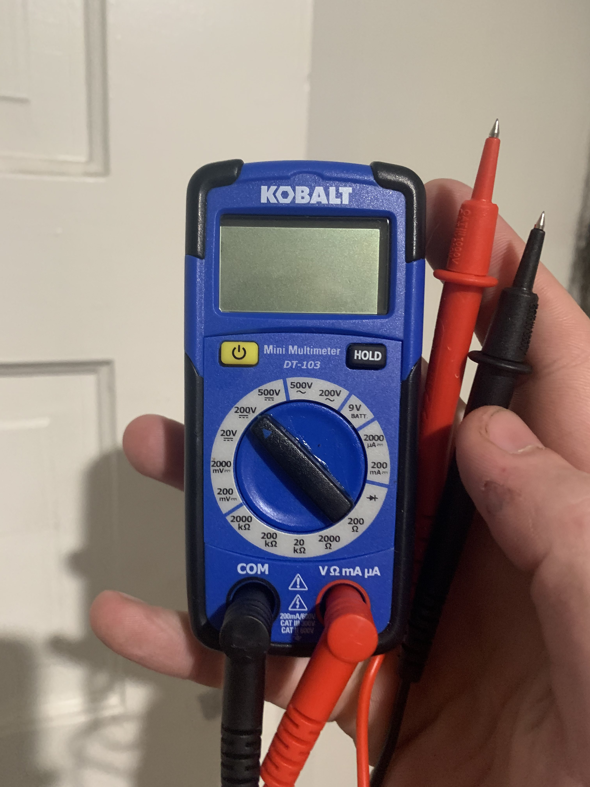

## UX Journal #1

Matthew Burns  
3/7/2021  
Usability Engineering

## Multimeter

Picture of device:  

Backstory:  
	I have an electric skateboard which I use to get around town whenever I’m heading somewhere that isn’t too far from where I live.  One day, my board stopped accelerating as fast as it used to, and its top speed lowered to about 12mph from its original top speed of 27mph.  I emailed the company’s customer support and they told me the problem was most likely the battery, and that I should buy a multimeter to test it.

My experience: 
	While this was my first experience with a multimeter, I can confidently say that it was a **satisfying** and **learnable** experience.  My goal was to measure the voltage of the battery of my board, to ensure that it was outputting 42 volts.  Right out of the box, it had an instruction manual that explained how to use the device.  This manual was very short and to the point, which I liked a lot since I feel that most manuals are pretty long and in small print, and deter people from actually reading them.  After I read how to use the device, I connected the cords to the multimeter, and took the battery out of the skateboard.  I then took the red and black cords from the multimeter, and connected them to the corresponding terminals on the battery.  After that, I read the fine print of the battery to figure out which setting I should change the multimeter to, in order to get an accurate reading of the battery (200v).  After I switched the multimeter to the correct setting, it displayed the voltage the battery was outputting to the screen.  It was very **useful** in narrowing down which part was the potential culprit and needed to be replaced.  It’s also a very **memorable** experience using the device, since it’s very easy to work.
  
  I would say this was a great user experience, as it was my first interaction with a device like this, and I was easily able to achieve my goal in a timely manner.  This device is very **efficient**, as well as **effective**.  It’s very good at doing its job, but in the wrong hands it could be a very **unsafe** experience.  If you have one of the cords connected to the battery and you then touch the prong on the other cord, you will complete the circuit and receive a shock.  This unfortunately doesn’t make the device very **error tolerant** in the hands of someone who might not understand the potential side effects.

